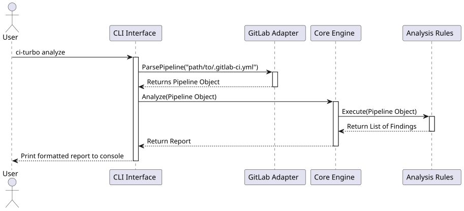

# **CI-Turbo: MVP Technical Documentation**

**Version:** 1.0  
**Status:** In Development  
**Primary Target:** GitLab CI Optimization

---

## **1. Product Overview**

### **1.1. Problem Statement**

Development teams lose significant time and money due to slow and inefficient CI/CD pipelines. These delays, often seen as a "tax on productivity," slow down the feedback loop, increase developer frustration, and ultimately hinder the company's ability to innovate and ship features quickly.

### **1.2. Proposed Solution**

**CI-Turbo** is a command-line interface (CLI) tool that acts as an intelligent performance analyzer for CI/CD configurations. It automatically scans pipeline definitions, identifies common performance bottlenecks, and provides clear, actionable recommendations for developers to implement.

The MVP focuses on providing immediate value by analyzing `.gitlab-ci.yml` files and suggesting improvements that can reduce build and test times by up to 50%.

### **1.3. Product Format**

The product is a standalone, single-binary CLI application written in **Go**. This format was chosen for several key reasons:
* **Ease of Distribution:** Users can download a single file for their OS with no dependencies.
* **Developer-Friendly:** It integrates naturally into a developer's terminal-based workflow.
* **Instant Value:** It provides analysis and results in seconds without requiring registration or complex setup.
* **Security:** It runs entirely locally, ensuring no source code or configuration ever leaves the user's machine.

---

## **2. System Architecture**

The architecture is designed to be simple, robust, and highly scalable, following a modular "Core + Adapters" pattern.

### **2.1. Architectural Views**

* **Logical View:** The system is divided into three main components: the **CLI Interface**, the **Core Analysis Engine**, and **CI Adapters**. This separation ensures that the core logic is independent of any specific CI/CD provider.
* **Process View:** A user runs the `analyze` command. The CLI invokes the appropriate adapter (e.g., GitLab Adapter), which parses the configuration file into a universal data model. This model is then passed to the Core Engine, which applies analysis rules and generates a report.
* **Physical View:** For the MVP, the entire application runs as a single process on the user's local machine or in a CI runner environment. There are no external network dependencies for the analysis itself.

Detailed Diagram of the Analysis Core Code Snippet

This diagram shows the high-level interaction between the main components.



Detailed Diagram of the Analysis Core Code Snippet



### **2.3. Sequence Diagram**

This diagram illustrates the runtime flow of the `analyze` command, showing the interaction between components over time.



---

## **3. Component Breakdown**

### **3.1. CLI Interface**
* **Technology:** Go (`cobra` library).
* **Responsibilities:**
  * Defining commands and flags (e.g., `ci-turbo analyze --path .gitlab-ci.yml`).
  * Parsing user input.
  * Invoking the appropriate components based on commands.
  * Formatting the final report for readable console output (e.g., with colors).
  * Handling top-level errors and providing helpful user feedback.

### **3.2. GitLab Adapter**
* **Technology:** Go (`gopkg.in/yaml.v3` library).
* **Responsibilities:**
  * Locating and reading the `.gitlab-ci.yml` file.
  * Parsing the YAML content into Go structs that mirror the GitLab CI syntax.
  * **Translating** the specific GitLab CI structures into the universal `Pipeline` data model used by the Core Engine. This is a crucial step for decoupling.
  * Gracefully handling YAML syntax errors.

### **3.3. Core Analysis Engine**
* **Technology:** Go (custom logic).
* **Responsibilities:**
  * Maintaining a registry of all available analysis rules.
  * Receiving a universal `Pipeline` object from an adapter.
  * Iterating through the registered rules and applying each one to the `Pipeline` object.
  * Collecting all `Finding` objects generated by the rules.
  * Passing the collection of findings to a report generator.

### **3.4. Analysis Rules**
Each rule is an isolated piece of logic that inspects the `Pipeline` model for a specific type of inefficiency. For the MVP, the following rules will be implemented:
* **`CachingRule`:**
  * **Detects:** Jobs that run package installation commands (e.g., `npm install`, `pip install`) but do not have a corresponding `cache` key defined.
  * **Suggests:** The correct `cache` configuration, including the optimal `key` based on lock files (`package-lock.json`, `poetry.lock`, etc.).
* **`ParallelismRule`:**
  * **Detects:** Jobs with names commonly associated with testing (e.g., `test`, `spec`, `e2e`) that are known to be long-running.
  * **Suggests:** Adding the `parallel` keyword to the job definition to split the test suite across multiple runners.

---

## **4. Data Model**

The data model consists of the universal Go structs used internally by the Core Engine to represent any CI/CD pipeline.

```go
// Pipeline is the top-level representation of a CI/CD configuration.
type Pipeline struct {
    Stages []string
    Jobs   map[string]Job
}

// Job represents a single task or job within a pipeline.
type Job struct {
    Name     string
    Stage    string
    Script   []string
    Cache    CacheConfig
    Parallel int
    // ... other universal fields
}

// CacheConfig represents the caching settings for a job.
type CacheConfig struct {
    Key   string
    Paths []string
}

// Finding represents a single issue detected by an analysis rule.
type Finding struct {
    RuleID      string   // e.g., "CACHE-001"
    Severity    string   // "Critical", "Warning"
    Message     string   // "Job 'install-deps' is missing a cache configuration."
    Suggestion  string   // "Add a 'cache' key with paths to your node_modules directory."
    JobName     string
}